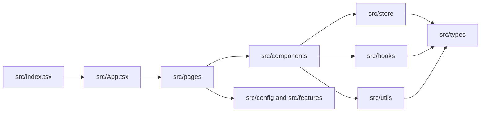

# Repository map and architecture overview

Issue: [#486](https://github.com/WxboySuper/Graphical-Forecast-Creator/issues/486)  
Parent tracker: [#434](https://github.com/WxboySuper/Graphical-Forecast-Creator/issues/434)

This is the current-state guide for contributors. It explains where behavior
lives, how the application is assembled, and which boundaries are intentional.
The [generated local inventory](../personal/repository-inventory.md) is the
exhaustive file-level companion; this document stays curated and human-sized.

## Product shape

GFC is a browser application for creating, discussing, monitoring, and
verifying graphical weather forecasts. The frontend is a Vite-built React
application. Hosted support code runs as an Express server on the VPS and
uses Firebase, Stripe, Sentry, and upstream weather services where enabled.

The product surfaces are:

| Surface | Primary entry point | Supporting areas |
| --- | --- | --- |
| Forecast | `src/pages/ForecastPage.tsx` | `src/components/ForecastWorkspace`, `src/components/Map`, `src/components/DrawingTools`, `src/store`, `src/utils` |
| Discussion | `src/pages/DiscussionPage.tsx` | `src/components/DiscussionEditor`, `src/pages/useDiscussion*` |
| Monitor | `src/pages/MonitorPage.tsx` | `src/components/Monitor`, `src/monitor`, `src/store` |
| Verification | `src/pages/VerificationPage.tsx` | `src/components/Verification`, `src/utils`, `src/store` |
| Hosted account and billing | `src/pages/AccountPage.tsx` | `src/auth`, `src/billing`, `server/account-lifecycle.js`, `server/billing.js` |
| Local documentation | `scripts/build-local-docs.mjs` | `docs`, `docs/personal`, `scripts` |

## Frontend flow

1. `src/index.tsx` creates the React root, initializes instrumentation, and
   renders `App`.
2. `src/App.tsx` composes providers and registers the route table.
3. Route pages compose feature components. Pages should coordinate a surface,
   not become a second home for domain logic.
4. Components use hooks, selectors, and utilities to read or update state.
5. `src/store/index.ts` configures Redux. Feature slices own durable client
   state; `src/types` owns contracts shared across state and UI.
6. `src/config` and `src/features` apply build-target, exposure, and
   server-capability policy before gated surfaces are rendered.

The normal dependency direction is:

The graph is a guide, not a ban on every reverse edge. Existing cross-feature
edges are recorded by the inventory generator so future move work can reduce
coupling deliberately rather than guessing.

## Frontend boundaries

| Boundary | Responsibility | Keep out |
| --- | --- | --- |
| `src/pages` | Route-level composition and surface coordination | Reusable domain algorithms and large presentational primitives |
| `src/components` | Feature UI and shared UI primitives | New global state ownership hidden inside leaf components |
| `src/hooks` | Stateful browser workflows and reusable React orchestration | Route registration and server-only logic |
| `src/store` | Redux configuration, slices, selectors, and client state transitions | Network calls that can live in service modules |
| `src/utils` | Pure transformations, persistence, geometry, export, and compatibility helpers | React rendering and undocumented feature-specific state |
| `src/monitor` | Monitor data contracts, upstream adapters, and layer synchronization | Generic UI primitives |
| `src/config` / `src/features` | Exposure, navigation, build target, and capability policy | Product behavior unrelated to access policy |
| `src/auth` / `src/billing` | Hosted identity and entitlement client integration | General forecast state |
| `src/types` / `src/maps` | Shared contracts and map adapter interfaces | Feature implementation |

## Server flow

`server/analytics.js` is the process entry point. It loads environment
configuration, creates the Express application through `server/analytics-app.js`,
and starts the HTTP listener. The app composes route modules for metrics,
Sentry tunneling, billing, account lifecycle, capability status, and Auto-TSTM.

| Server area | Responsibility |
| --- | --- |
| `server/*.js` | HTTP entry points, route registration, service-facing modules, and colocated tests |
| `server/lib` | Reusable capability, release, deployment-target, and emergency-disable helpers |
| `server/release` | VPS rollout and promotion helpers |
| `server/weather` | Weather-generation and Auto-TSTM support code |
| `server/testing` | Server test fixtures and exposure harnesses |

Server modules must fail closed for hosted capability checks, validate external
input at the route boundary, and keep secrets/configuration out of client
bundles. Tests are colocated with the code they protect.

## Storage and hosted services

- Browser-only forecast and preference state uses Redux plus local storage.
- Firebase Auth and Firestore back hosted identity and cloud-cycle features.
- Stripe is the source of truth for premium subscription state; the server
  validates webhook transitions before updating entitlements.
- Sentry is optional by environment and configured through deployment secrets.
- Weather and alert data comes from upstream services and is normalized before
  reaching UI components.

These services are optional from the local developer experience. A local build
must remain useful without hosted credentials, while hosted-only capabilities
must be visibly gated and server-checked.

## Build, test, and deployment

| Concern | Location / command |
| --- | --- |
| Dependency source of truth | `package.json`, `pnpm-lock.yaml` |
| Type checking | `pnpm run typecheck` |
| Unit/component tests | `pnpm test` |
| Browser tests | `pnpm run test:e2e` |
| Production frontend bundle | `pnpm run build` |
| CI policy and checks | `.github/workflows/ci.yml`, `.github/workflows/pr-governance.yml` |
| Main deployment | `.github/workflows/deploy-main-to-vps.yml` |
| Release automation | `.github/workflows/release-stable.yml`, `scripts`, `server/release` |

`VITE_BUILD_TARGET` selects `local`, `beta`, `staging`, or `production` and is
separate from the beta access gate. CI and deployment workflows set the target
explicitly; local development defaults to `local`.

## Current structure versus target direction

The current layout is intentionally incremental. The largest remaining
boundary pressure is `src/components`, which contains both feature-owned UI
and shared primitives. `src/monitor` and `src/components/Monitor` also split
one product surface between domain and UI folders. These are not reasons for a
wide move now: each future extraction should be a behavior-preserving PR with
tests and compatibility exports where needed.

The preferred move order is:

1. Establish feature APIs for Forecast, Monitor, Verification, and Discussion.
2. Move feature-owned components, hooks, and utilities behind those APIs.
3. Keep genuinely shared contracts in `src/types` and map interfaces in
   `src/maps` rather than creating a catch-all `shared` folder.
4. Separate hosted client/server concerns after feature boundaries stabilize.

This ordering is a target plan, not current-state documentation. It does not
authorize runtime moves as part of this documentation issue.

## Contributor navigation

- Start with the boundary README beside the folder you will change.
- Trace from the route page to its feature components, then to hooks/store/
  utilities before changing a shared contract.
- Update documentation in the same PR when a path or ownership boundary moves.
- Use `pnpm run docs:inventory` to regenerate ignored local inventory data.
- Use `pnpm run docs:site` to render a local, searchable documentation site.

Generated files belong under `docs/personal` and are ignored by design. Do not
commit local planning or generated HTML artifacts.
